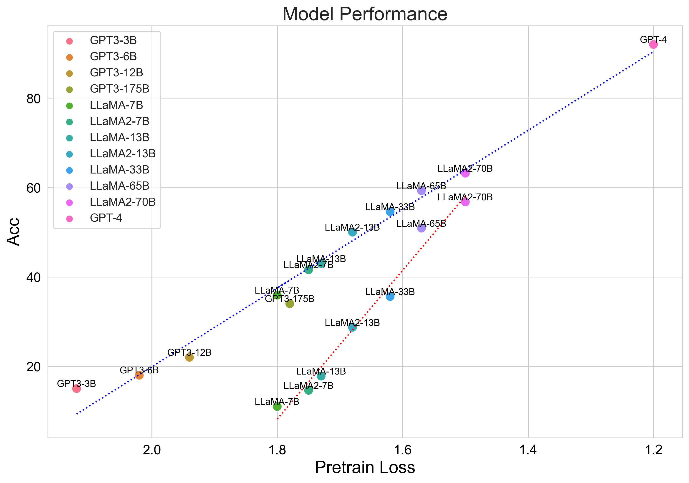
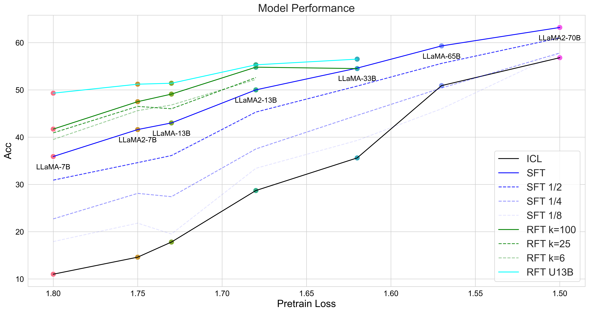

# Scaling Relationship on Learning Mathematical Reasoning with Large Language Models

The code and data used for reproducing results of [Scaling Relationship on Learning Mathematical Reasoning with Large Language Models](https://arxiv.org/abs/2308.01825) and [Query and Response Augmentation Cannot Help Out-of-domain Math Reasoning Generalization](https://arxiv.org/abs/2310.05506).

- [2023.10] We have a new paper that investigates the scaling of in-domain and out-of-domain generalization on augmented math problems.
- [2023.9] Paper updated with more details on 65B and 70B models.

| Setting    | 7B       | 7B-2     | 13B      | 13B-2    | 33B      | 65B      | 70B-2    |
|------------|----------|----------|----------|----------|----------|----------|----------|
| ICL-8shot  | 11.0/18.1| 14.6/-   | 17.8/29.3| 28.7/-   | 35.6/53.1| 50.9/69.7| 56.8/-   |
| SFT        | 35.9/48.7| 41.6/55.4| 43.0/55.2| 50.0/61.7| 54.6/-   | 59.3/-   | 63.2/-   |
| RFT k=100  | 41.7/52.7| 47.5/58.7| 49.1/59.9| 54.8/65.4| 54.5/-   | -        | -        |
| RFT-U13B   | 49.3/61.8| 50.3/65.6| 52.1/66.2| 55.4/69.1| 56.5/-   | 59.0/-   | 62.3/-   |
| RFT-U33B   | 49.1/61.6| 51.2/64.1| 51.4/66.3| 55.3/69.1| 57.9/-   | 59.7/-   | 64.8/-   |

Metrics are maj1@1 and maj1@100.

# Findings from the paper



# SFT Training

If you cannot reproduce our results, please try using Transformers <= 4.29 and test with batch size=1.

Use **train_xb.sh** for fine-tuning LLaMA and LLaMA-2.
```bash
bash train_xb.sh ./data/train_use.jsonl SAVE_PATH 3
```

# RFT Inference

LLaMA 7B / 13B
```bash
bash group_sample_7b_13b.sh SAVE_PATH
```

LLaMA 30B
```bash
bash group_sample_30b.sh SAVE_PATH
```

## Filter reasoning paths

```python
python collect_rejection_sampling.py
```

# RFT Training

For RFT using LLaMA-7B/7B-2/13B/13B-2/33B generated samples with k=100.
```bash
bash train_xb.sh ./data/rft/llama_yb.jsonl SAVE_PATH 3
```

For RFT using U13B.
```bash
bash train_xb.sh ./data/rft/u13b.jsonl SAVE_PATH 3
```

For RFT using U33B.
```bash
bash train_xb.sh ./data/rft/u33b.jsonl SAVE_PATH 3
```


# Evaluation

We use greedy decode for the test set.

For evaluate 7B/13B models:
```bash
bash test_7b_13b.sh SAVE_PATH
```

For evaluate 30B models:
```bash
bash single_test_30b.sh SAVE_PATH 0 ./data/test_jsonl.sh
```

For evaluate 65B / 70B models:
```bash
bash single_test_65b.sh SAVE_PATH 0,1 ./data/test_jsonl.sh
```

Use **eval.py** to obtain the scores, and it also supports maj1@K.

# GPU Usage
|                   | 7B / 13B | 33B | 65B / 70B |
| ----------------- | -------- | --- | --------- |
| SFT / RFT         | 8        | 16  | 32        |
| Minimal Inference | 1        | 1   | 2         |
| Group Inference   | 8        | 8   | 8         |

# Checkpoints

|                   | 7B  | 7B2 | 13B | 13B2 | 33B|
| ----------------- | -------- | --- | --------- |--------- |--------- |
| RFT k = 100 | [OFA-Sys/gsm8k-rft-llama7b-sample100](https://huggingface.co/OFA-Sys/gsm8k-rft-llama7b-sample100) | | | |
| RFT U13B | [OFA-Sys/gsm8k-rft-llama7b-u13b](https://huggingface.co/OFA-Sys/gsm8k-rft-llama7b-u13b) | [OFA-Sys/gsm8k-rft-llama7b2-u13b](https://huggingface.co/OFA-Sys/gsm8k-rft-llama7b2-u13b) | [OFA-Sys/gsm8k-rft-llama13b-u13b](https://huggingface.co/OFA-Sys/gsm8k-rft-llama13b-u13b) | [OFA-Sys/gsm8k-rft-llama13b2-u13b](https://huggingface.co/OFA-Sys/gsm8k-rft-llama13b2-u13b) |
| RFT U33B | ||||[OFA-Sys/gsm8k-rft-llama33b-u33b](https://huggingface.co/OFA-Sys/gsm8k-rft-llama13b-u13b)|


# Citation
```
@misc{yuan2023scaling,
      title={Scaling Relationship on Learning Mathematical Reasoning with Large Language Models}, 
      author={Zheng Yuan and Hongyi Yuan and Chengpeng Li and Guanting Dong and Keming Lu and Chuanqi Tan and Chang Zhou and Jingren Zhou},
      year={2023},
      eprint={2308.01825},
      archivePrefix={arXiv},
      primaryClass={cs.CL}
}
```

```
@misc{li2023query,
      title={Query and Response Augmentation Cannot Help Out-of-domain Math Reasoning Generalization}, 
      author={Chengpeng Li and Zheng Yuan and Guanting Dong and Keming Lu and Jiancan Wu and Chuanqi Tan and Xiang Wang and Chang Zhou},
      year={2023},
      eprint={2310.05506},
      archivePrefix={arXiv},
      primaryClass={cs.CL}
}
```
